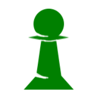

<a name="readme-top" />
<!-- PROJECT LOGO -->
 

  

  <h3 align="center" style="color:#008000;">>code_gambit</h3>

  

    learn the basics of coding by playing chess!
     
     
    <a href="https://github.com/joshbacon/codegambit">View Site</a>
    ·
    <a href="https://github.com/joshbacon/codegambit/issues/new">Report Bug</a>
    ·
    <a href="https://github.com/joshbacon/codegambit/issues/new">Request Feature</a>
  

<!-- ABOUT THE PROJECT -->
## About The Project

[![codegambit Screen Shot][product-screenshot]](https://codegambit.io)

`codegambit` is web app aimed to get users used to entering commands and writing simple commands in the context of playing chess. Play a game against a bot or a friend by entering commands into a terminal. You can also complete lessons by writing scripts that execute multiple moves to solve the problem.

### Built With

This project is built with a number of tools. The frontend is built with React JS making use of the Material UI library. For the backend, a Go API communicates with a MySQL database. Next.js and Node.js are used on the server side along with nginx to increase performance.

* [![React][React.js]][React-url]
* [![mui][mui.com]][mui-url]
* [![MySQL][MySQL]][MySQL-url]
* [![go][go]][go-url]
* [![nginx][nginx.com]][nginx-url]

<!-- ROADMAP -->
## Roadmap

- [x] Finalize base-application
- [ ] Migrate to Next.js for SSR
- [ ] Add multiplayer

See the [open issues](https://github.com/joshbacon/codegambit/issues) for a full list of proposed features (and known issues).

<!-- LICENSE -->
<!-- ## License

Distributed under the MIT License. See `LICENSE.txt` for more information. -->

(<a href="#readme-top">back to top</a>)

<!-- MARKDOWN LINKS & IMAGES -->
<!-- https://www.markdownguide.org/basic-syntax/#reference-style-links -->
[product-screenshot]: ./public/example.png
[React.js]: https://img.shields.io/badge/React-20232A?style=for-the-badge&logo=react&logoColor=61DAFB
[React-url]: https://reactjs.org/
[mui.com]: https://img.shields.io/badge/mui-007FFF?style=for-the-badge&logo=mui&logoColor=white
[mui-url]: https://mui.com/
[Node.js]: https://img.shields.io/badge/Node.js-000000?style=for-the-badge&logo=Node.js
[Node-url]: https://nodejs.org/en/
[Next.js]: https://img.shields.io/badge/next.js-000000?style=for-the-badge&logo=nextdotjs&logoColor=white
[Next-url]: https://nextjs.org/
[MySQL]: https://img.shields.io/badge/MySQL-4479A1?style=for-the-badge&logo=MySQL&logoColor=white
[MySQL-url]: https://www.mysql.com/
[go]: https://img.shields.io/badge/Go-00ADD8?style=for-the-badge&logo=Go&logoColor=white
[go-url]: https://golang.google.cn/
[nginx.com]: https://img.shields.io/badge/NGINX-009639?style=for-the-badge&logo=NGINX
[nginx-url]: https://nginx.org/en/